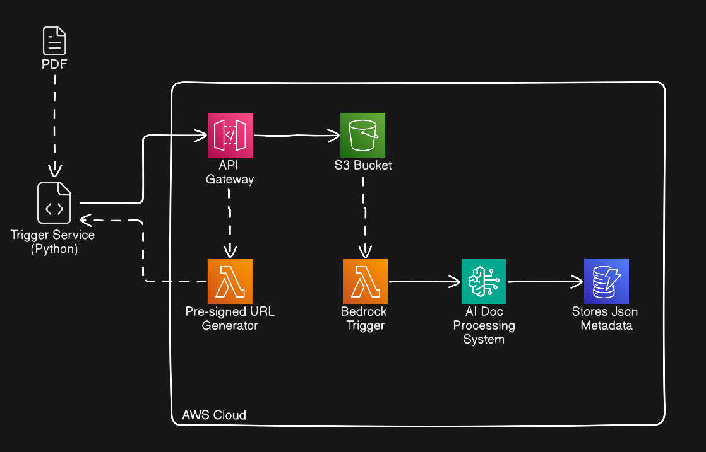

# Intelligent Document Processing (IDP)

## General Description

This project showcases a cloud-native Intelligent Document Processing (IDP) system built on Amazon Web Services (AWS). It features an automated pipeline integrated with Amazon Bedrock to process PDF documents uploaded via a local client script. The system leverages Generative AI to extract meaningful metadata from these documents and stores the structured results in Amazon DynamoDB for downstream data analytics.

## Technologies and Specs

- **Cloud Provider:** Amazon Web Services (AWS)
- **Infrastructure as Code (IaC):** Terraform
- **Generative AI:** Amazon Bedrock
- **Compute:** AWS Lambda
- **Storage:** Amazon S3 (Object Storage), Amazon DynamoDB (NoSQL Database)
- **API Management:** Amazon API Gateway
- **Client Application:** Python (`client_trigger.py`)

## Project Architecture and Diagrams

### Architecture Overview

The primary objective of this project is to automate the extraction of insights and metadata from unstructured PDF documents using artificial intelligence. This eliminates manual data entry and prepares the data for scalable analysis.

The system architecture follows a serverless, event-driven pattern designed for high availability, security, and cost-efficiency.

**System Workflow:**

1. **Secure Upload Initialization:** A local client script (`client_trigger.py`) requests an upload authorization through the API Gateway.
2. **Pre-Signed URL Generation:** An AWS Lambda function authenticates the request and generates a secure, time-limited Pre-Signed URL.
3. **Direct S3 Upload:** The client script uses the generated URL to upload the PDF directly to an Amazon S3 bucket.
4. **Event-Driven AI Processing:** The successful S3 upload automatically triggers a second Lambda function. This function invokes Amazon Bedrock, utilizing predefined prompts and guardrails to process the PDF and extract metadata using a Generative AI model.
5. **Data Persistence:** The AI-extracted insights are formatted as a detailed JSON payload and stored in an Amazon DynamoDB table for fast retrieval and further analytics.

**Why this Architecture?**

This serverless approach was chosen to decouple the file upload process from the heavy AI processing workload. By leveraging Pre-Signed URLs, the system offloads large file transfers directly to S3, preventing timeouts and bottlenecks at the API Gateway and Lambda layers. Furthermore, the event-driven design ensures that the AI model (and associated compute costs) is only invoked precisely when new data arrives, optimizing resource utilization.

### Infrastructure Setup Steps

- **AWS CLI:** Configure the AWS CLI with credentials that allow access to required cloud resources, enabling local deployment and authorized third-party access (e.g., Terraform).
- **IaC Deployment:** Use Terraform to provision the AWS infrastructure, configuring required providers and variables. This includes the S3 buckets and Lambda functions.
- **API Gateway:** Deploy the API Gateway, ensuring a Usage Plan is created and linked to an AWS API Key for secure client access.
- **Bedrock Configuration:** Provision the Amazon Bedrock infrastructure, defining the specific prompts, guardrails, and model parameters required for the Generative AI processing.

## Endpoints

### `/request-upload`

- **Method:** `POST`
- **Description:** Initiates the document upload process. It authenticates the client using an API Key and returns an AWS S3 Pre-Signed URL, which allows the client to securely upload the PDF directly to the S3 bucket.
- **Client Integration:** This endpoint is configured and triggered by the local `client_trigger.py` script.
- **Required Headers:**
  - `x-api-key`: Your AWS API Gateway key.
  - `Content-Type`: `application/json`

## FAQ

**How do I configure my local environment variables?**

Use the `.env.example` file in the root directory as a template. Copy it to create your own local `.env` file and fill in your specific credentials and settings.

**What versions of Python and Terraform are required?**

This project requires **Python 3** and the latest Long-Term Support (**LTS**) version of **Terraform**.

**How do I configure the AWS region and Bedrock LLM?**

You should define your target AWS region and select the specific Amazon Bedrock foundation model (LLM) inside the `terraform/variables.tf` file.

**How is the Pre-Signed URL Lambda triggered?**

The initial Lambda function (`terraform/presigned_url_lambda/lambda_function.py`) is triggered by the API Gateway endpoint. To establish this secure connection, you must create a Usage Plan, link it to your AWS API Key, and associate it with the deployed API Gateway.

**What are the recommended API Gateway rate limits?**

While you have the freedom to define your own rate limits, we strongly suggest the following FinOps-based configuration to prevent unexpected billing spikes:
- **Rate:** 10 requests per second
- **Burst:** 20 requests
- **Quota:** 5000 requests per month

**Can this system process PDFs larger than 500MB?**

By default, the project is optimized for PDFs under 500MB. If you need to process larger files (e.g., > 1GB), you must:
1. Increase the `/tmp` storage size of the Bedrock Lambda function up to a maximum of 10GB (AWS Lambda limit).
2. Modify the code in `terraform/bedrock_lambda/bedrock_lambda_function.py` (around lines 29 and 30) to handle larger memory requirements and prevent Out-Of-Memory (OOM) errors. 
3. Implement batch processing. The `helpers/pdf_processing.py` file provides a logical structure for this adaptation: it reads the file header to determine the size and, if it exceeds the limit, triggers the Batch Processing logic to chunk the document.

**Does batch processing large PDFs reduce costs?**

Batch processing is essential to prevent congestion and timeouts in both the Lambda function and the Bedrock LLM. However, **it does not significantly reduce token costs**. Because the system fragments the massive PDF into smaller groups of pages and makes multiple sequential requests to Bedrock, the total token consumption will be similar. Consequently, it will also save multiple metadata records in DynamoDB for a single large PDF.

**How can I estimate the token cost for Amazon Bedrock?**

Token costs vary depending on the chosen model and the AWS region. Please note that some regions have a limited selection of models available. It is highly recommended to simulate your expected costs using the [AWS Pricing Calculator](https://calculator.aws/) and review the official [Amazon Bedrock Pricing](https://aws.amazon.com/bedrock/pricing/).

**Are all necessary permissions handled automatically?**

Terraform provisions the core operational permissions required for the pipeline to work. However, specific monitoring and logging features might require you to manually create additional CloudWatch permissions or enable account-level settings. AWS typically notifies you of these requirements within the console, so remain alert to any system notifications or logging alerts.
